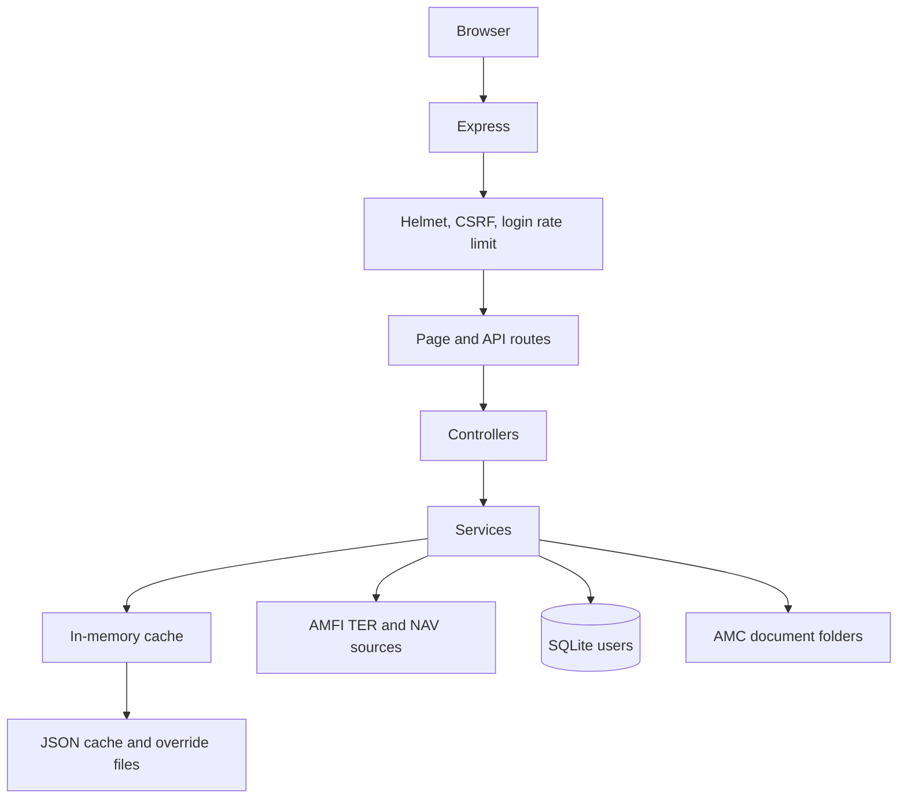

# Mutual Fund TER Portal

## 1. Overview

The Mutual Fund TER Portal is an Express/EJS web application for viewing and maintaining mutual-fund Total Expense Ratio (TER), NAV, brokerage, commission, launch-date, and AMC document data.

The application fetches TER data and NAV data from AMFI, matches the two datasets by normalized scheme name, and serves the result through a searchable matrix UI and JSON APIs. Operational data is persisted as JSON files and AMC document folders. User accounts are stored in SQLite.

## 2. Technology Stack

| Area | Technology |
| --- | --- |
| Runtime | Node.js `>=22.5.0` |
| Server | Express 4 |
| Views | EJS |
| Browser UI | Vanilla JavaScript and CSS |
| External sources | AMFI TER endpoints and `NAVAll.txt` |
| Excel files | `xlsx` |
| Authentication | HMAC-signed cookie sessions and `bcryptjs` |
| User database | Node built-in SQLite (`node:sqlite`) |
| Scheduling | `node-schedule`, timezone `Asia/Kolkata` |
| Security | Helmet, CSRF double-submit tokens, login rate limiting, upload validation |

## 3. Quick Start

### Prerequisites

- Node.js `22.5.0` or newer
- npm
- Network access to AMFI for a live refresh

### Install and run

```powershell
cd "c:\Users\ss\Desktop\New folder (10)\ter-portal"
npm install
npm start
```

Open the URL printed in the server log. The default HTTP port is `3000`. If that port is already in use, the server tries the next five ports automatically.

Development mode, with automatic restart:

```powershell
npm run dev
```

Run automated tests:

```powershell
npm test
```

## 4. Configuration

Configuration is read from environment variables by `config/app.js` and the services that own each setting. A local `.env` file is supported through `dotenv`.

| Variable | Default | Purpose |
| --- | --- | --- |
| `PORT` | `3000` (`7443` with HTTPS) | Listening port |
| `HOST` | `0.0.0.0` | Listening address |
| `NODE_ENV` | `development` | Runtime environment |
| `HTTPS` | `false` | Enable HTTPS |
| `TLS_PFX_PATH` | `certs/lan.pfx` | PFX certificate path |
| `TLS_PFX_PASSPHRASE` | unset | PFX passphrase |
| `SESSION_SECRET` | local development fallback | Session HMAC secret; required in production |
| `ADMIN_USERNAME` | `admin` | Seed username when the user store is empty |
| `ADMIN_PASSWORD` | `admin123` | Seed password when the user store is empty |
| `CACHE_REFRESH_INTERVAL` | `30` | Legacy/general cache interval setting |
| `REQUEST_TIMEOUT` | `30000` | AMFI request timeout in milliseconds |
| `AMFI_TER_URL` | AMFI TER page | TER data source |
| `AMFI_NAV_URL` | AMFI `NAVAll.txt` | NAV data source |
| `DB_PATH` | `data/app.db` | SQLite database path |
| `TER_CACHE_PATH` | `ter-cache.json` | Main scheme cache path |
| `TER_MANUAL_SYNC_PATH` | `ter-manual-sync.json` | Manual sync snapshot path |
| `COMMISSION_OVERRIDE_CACHE_PATH` | `commission-override-cache.json` | Commission override path |
| `LAUNCH_DATE_OVERRIDE_CACHE_PATH` | `launch-date-override-cache.json` | Launch-date override path |
| `LAUNCH_DATE_WORKBOOK_PATH` | configured reference workbook | Launch-date workbook path |
| `AMC_DOCUMENTS_ROOT` | `data/amc-documents` | AMC document root |
| `USERS_FILE_PATH` | `data/users.json` | One-time legacy user import source |

For production, set a long random `SESSION_SECRET`, change the default admin password, and use HTTPS with a valid certificate.

## 5. Application Flow



At startup, the server loads environment configuration, mounts middleware and routes, loads persisted cache/overrides, and starts the scheduler. If a usable cache exists, it is served immediately and a refresh runs in the background. Without usable cache data, startup performs a refresh before the scheduler starts.

The full refresh fetches TER and NAV data in parallel, merges them using `services/matchService.js`, validates the resulting size, and persists a good result. A suspiciously small response is rejected so an AMFI failure cannot overwrite a known-good cache. A refresh failure leaves existing cached data available.

## 6. Scheduled Refresh

The scheduler in `services/schedulerService.js` runs a full AMFI refresh daily at:

- 10:00 IST
- 12:00 IST
- 14:00 IST
- 16:00 IST

The schedule uses `Asia/Kolkata`, not the machine's local timezone. A manual refresh is also available to authenticated `admin` and `data_operator` users through `GET /api/refresh`.

NAV data is reused in memory for four hours. Period-specific TER requests use a 25-second timeout and fall back to the last available data with a stale marker when AMFI is unavailable.

## 7. User Interface

| Page | URL | Purpose |
| --- | --- | --- |
| TER matrix | `/` | Browse, filter, sort, edit, and export current scheme data |
| Old brokerage | `/old-brokerage-data` | View and maintain historical brokerage records |
| Login | `/login` | Authenticate a user |
| User administration | `/admin/users` | Create, update, and delete users; admin only |
| About | `/about` | Application information |
| AMC shortcut | `/:amc` | Render the home view for an AMC route |

The main matrix supports AMC, category, type, scheme, NSDL, and AMFI filters, pagination, column visibility, CSV/Excel export, clipboard copy, printing, and role-based editing. The old brokerage page supports validity-period filtering, historical uploads, editing, deletion, and exports.

## 8. Step-by-Step Page Guide with Screenshots

The following screenshots show the main user-facing pages in the normal workflow. Screenshots are stored in `docs/screenshots/` and are embedded in the PDF version of this document.

### Step 1: Login

1. Open `/login`.
2. Enter the username and password supplied by an administrator.
3. Select **Login**.
4. After authentication, return to the portal home page. Admin and data-operator users see additional upload and management actions.


### Step 2: Review the TER Matrix

1. Open `/`.
2. Review the dashboard metrics and latest data period.
3. Select an AMC, category, type, brokerage period, or search field to filter schemes.
4. Use column sorting, pagination, export, copy, or print controls as needed.
5. Authenticated data-role users can select a row's edit action to update permitted values.


### Step 3: Review Historical Brokerage

1. Select **All Brokerage Data** or open `/old-brokerage-data`.
2. Filter by financial year, date range, AMC, category, ARN, or scheme name.
3. Review the validity period and year-wise brokerage values.
4. Use export or print controls for reporting.
5. Authenticated data-role users can upload, add, edit, or delete historical records.


### Step 4: View About and Data Source Information

1. Select **About** from the footer or open `/about`.
2. Review the AMFI data sources, matching behavior, calculations, API summary, and disclaimer.


### Step 5: Manage Users as an Administrator

1. Sign in with an administrator account.
2. Open **Users** or `/admin/users`.
3. Create a viewer, data-operator, or admin account by entering a username, password, and role.
4. Use the key action to change a user's password.
5. Use the delete action when an account is no longer required.
6. The application prevents self-deletion and deletion of the only remaining admin account.


## 9. Roles and Permissions

Valid roles are `admin`, `data_operator`, and `viewer`.

| Capability | Viewer | Data operator | Admin |
| --- | ---: | ---: | ---: |
| View, filter, and export data | Yes | Yes | Yes |
| Edit scheme and launch-date values | No | Yes | Yes |
| Upload commission or brokerage data | No | Yes | Yes |
| Save sync and clear overrides | No | Yes | Yes |
| Manage AMC documents | No | Yes | Yes |
| Manage users | No | No | Yes |

The only-admin safeguards prevent changing or deleting the final administrator. Usernames are normalized to lowercase and passwords must contain at least four characters. Passwords are stored as bcrypt hashes. Legacy SHA-256 records are upgraded to bcrypt after a successful login.

## 10. Data Sources and Matching

### AMFI TER and NAV

`services/terService.js` retrieves TER periods and rows from AMFI. `services/navService.js` retrieves and parses the configured NAV text file. `services/matchService.js` normalizes scheme names and computes a similarity score. The configured minimum match confidence is `80`.

Unmatched TER rows remain visible; they simply do not receive a matched AMFI/NAV code or value.

### Launch dates

Launch-date resolution uses this priority:

1. Manual override in `launch-date-override-cache.json`.
2. Reference workbook configured by `LAUNCH_DATE_WORKBOOK_PATH`.
3. Existing AMFI/cache value.
4. Empty value.

### Commission and brokerage

Commission uploads and inline edits are persisted in `commission-override-cache.json`. Historical brokerage changes are persisted in `old-brokerage-override-cache.json`, including deletion tombstones. Old brokerage records are keyed by AMC, scheme, and period, and only supported ARN values are exposed by the service.

For each year, the commission-to-BER ratio is:

$$C/B_n = \frac{Commission_n}{Regular\ BER}$$

The UI displays a dash when commission or BER is missing, or when BER is zero.

## 11. API Reference

All API paths below are relative to `/api`.

### Read endpoints

| Method | Endpoint | Description |
| --- | --- | --- |
| GET | `/schemes` | Scheme matrix; supports period, filter, paging, and search parameters |
| GET | `/amcs` | AMC catalog |
| GET | `/categories` | Scheme categories |
| GET | `/types` | Scheme types |
| GET | `/status` | Cache status and refresh information |
| GET | `/dashboard` | Dashboard counts and TER statistics |
| GET | `/periods` | Available financial years |
| GET | `/months?year=...` | Available TER months for a year |
| GET | `/old-brokerage` | Historical brokerage data |
| GET | `/sync/old` | Saved manual sync snapshot |
| GET | `/amcs/:amc/documents` | List AMC documents |
| GET | `/amcs/:amc/documents/:documentId/file` | View/download a document |
| GET | `/amcs/:amc/documents/:documentId/download` | View/download a document |

### Protected data endpoints

These require an authenticated `admin` or `data_operator` session unless noted otherwise.

| Method | Endpoint | Description |
| --- | --- | --- |
| GET | `/refresh` | Start a background full refresh |
| POST | `/sync/save` | Save the current cache as a manual snapshot |
| POST | `/clear-old-brokerage` | Clear commission overrides |
| POST | `/schemes/update` | Update scheme values or launch date |
| POST | `/upload/commission` | Upload commission structure workbook |
| POST | `/upload/brokerage-matrix` | Upload consolidated brokerage workbook |
| POST | `/upload/launch-dates` | Upload launch-date workbook |
| POST | `/old-brokerage/update` | Create or update historical data |
| POST | `/old-brokerage/delete` | Delete historical data via override/tombstone |
| POST | `/old-brokerage/upload` | Upload historical brokerage workbook |
| GET | `/download/demo-commission-file` | Download commission template |
| GET | `/old-brokerage/demo-download` | Download historical template |
| POST | `/amcs/:amc/documents` | Upload up to 20 AMC documents |
| PUT | `/amcs/:amc/documents/:id` | Replace an AMC document |
| DELETE | `/amcs/:amc/documents/:id` | Delete an AMC document |

### Admin endpoints

| Method | Endpoint | Description |
| --- | --- | --- |
| GET | `/users` | List users |
| POST | `/users` | Create a user |
| PUT | `/users/:username/password` | Change a user's password |
| DELETE | `/users/:username` | Delete a user |

All state-changing requests require the CSRF token issued by the application. Uploads are held in memory, limited to 20 MB, and restricted to `.xlsx`/`.xls`; AMC documents additionally allow `.pdf`.

## 12. Persistence Layout

| Path | Purpose |
| --- | --- |
| `ter-cache.json` | Last successful main scheme snapshot |
| `ter-manual-sync.json` | Operator-approved fallback snapshot |
| `commission-override-cache.json` | Commission overrides |
| `old-brokerage-override-cache.json` | Historical overrides and tombstones |
| `launch-date-override-cache.json` | Launch-date overrides |
| `data/app.db` | SQLite users database |
| `data/users.json` | Legacy user import source |
| `data/amc-documents/<amc-slug>/` | AMC document metadata and files |

AMC folders contain `documents.json` metadata and a `files/` directory. Scheme and commission data are not stored in SQLite.

## 13. Security and Operational Notes

- Production startup refuses to run without `SESSION_SECRET`.
- Session cookies are HTTP-only and `SameSite=Lax`.
- Helmet supplies security headers and the application uses a restrictive content security policy.
- Login attempts are limited to 10 per IP per 15 minutes.
- All write requests use double-submit CSRF protection.
- Upload filenames are validated and document files are sanitized before storage.
- The server logs uncaught exceptions and unhandled rejections without silently terminating the process.
- Keep cache, override, SQLite, certificate, and AMC document paths backed up before deployment or bulk uploads.

## 14. Tests

Run the current Node test suite with:

```powershell
npm test
```

Current test files cover AMC document behavior, cache behavior, user authentication/storage, and year-label handling. Recommended future coverage includes route-level authorization, upload parser fixtures, ratio calculations, refresh fallback behavior, and browser smoke tests for each role.

## 15. Troubleshooting

| Symptom | Checks |
| --- | --- |
| Empty or loading matrix | Check server logs, `/api/status`, AMFI connectivity, and `ter-cache.json` |
| Stale data | Check the UI stale marker, AMFI availability, and `ter-manual-sync.json` |
| Missing commission | Check workbook headers, scheme-name matching, and commission overrides |
| Missing historical row | Check ARN, period format, AMC/scheme identity, and tombstones |
| Upload rejected | Check extension, 20 MB limit, required columns, login, and CSRF token |
| Login failure | Check `data/app.db`, credentials, role, and `SESSION_SECRET` |
| Document not visible | Check AMC slug, `documents.json`, and the document `files/` directory |

## 16. Source Map

| Concern | Main files |
| --- | --- |
| Bootstrap and middleware | `server.js`, `config/app.js` |
| Pages and views | `routes/pages.js`, `controllers/pageController.js`, `views/` |
| APIs | `routes/api.js`, `controllers/` |
| TER/NAV ingestion | `services/terService.js`, `services/navService.js`, `services/terParser.js` |
| Matching | `services/matchService.js`, `helpers/normalizer.js` |
| Refresh and cache | `services/dataService.js`, `services/cacheService.js` |
| Scheduling | `services/schedulerService.js` |
| Users/authentication | `services/db.js`, `services/userService.js`, `middleware/csrf.js` |
| Commission | `services/excelUploadService.js`, `services/commissionOverrideService.js` |
| Historical brokerage | `services/oldBrokerageService.js`, `services/Oldbrokerageuploadservice.js`, `services/oldBrokerageOverrideService.js` |
| AMC documents | `services/amcDocumentService.js`, `controllers/documentController.js` |
| Browser UI | `public/js/`, `public/css/`, `views/` |
